# SpoolLink for Android — User Guide

## Scan — Idle

The default view on launch. Tap **Start Scanning** to activate NFC foreground dispatch.

<a href="images/android/01-scan-idle.png">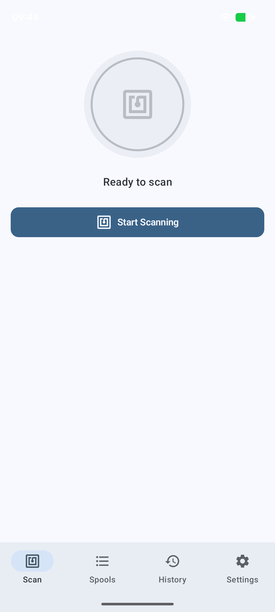</a>

## Scan — Tag Read (No OpenSpool Data)

Any NFC tag is supported. When no OpenSpool record is present, the tag is still detected
and the card UID is shown. Both Spoolman actions remain available — OpenSpool data is
only used to pre-fill fields when creating a new spool.

<a href="images/android/02-scan-result-empty-tag.png">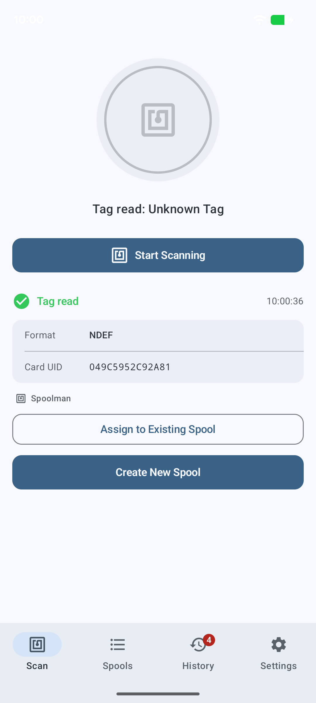</a>

## Scan — Tag Read (OpenSpool)

When an OpenSpool 1.0 tag is scanned, the full filament data (format, material, brand,
color, temperatures, card UID) is displayed and used to pre-fill the Create Spool form.

<a href="images/android/03-scan-result-openspool.png">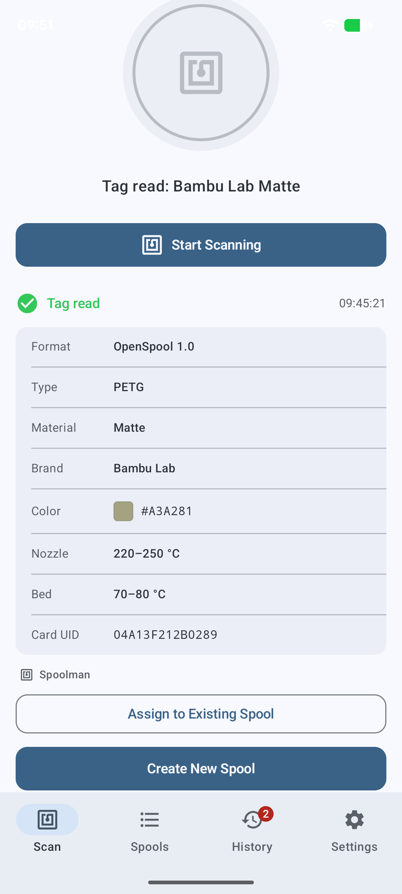</a>

## Scan — Tag Already Assigned

When a scanned tag is already linked to a spool, the spool is shown with two actions:
**Change Spool** (reassign to a different spool) or **Unlink from Spool** (remove the
tag UID from the current spool).

<a href="images/android/04-scan-result-assigned.png">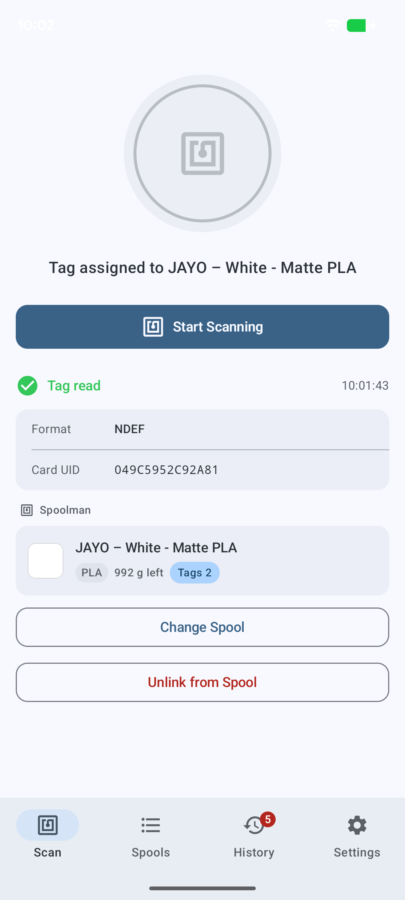</a>

## Assign to Existing Spool

Searchable list of all spools on the Spoolman server. Selecting one links the scanned
tag UID to that spool. A tag can only belong to one spool at a time — if it was
previously assigned elsewhere, it is automatically removed from that spool.

> **Tip:** Spools typically have two tags, one attached to each side. Assign both tags
> to the same spool so it is detected no matter which side faces the reader.

<a href="images/android/05-assign-spool-sheet.png">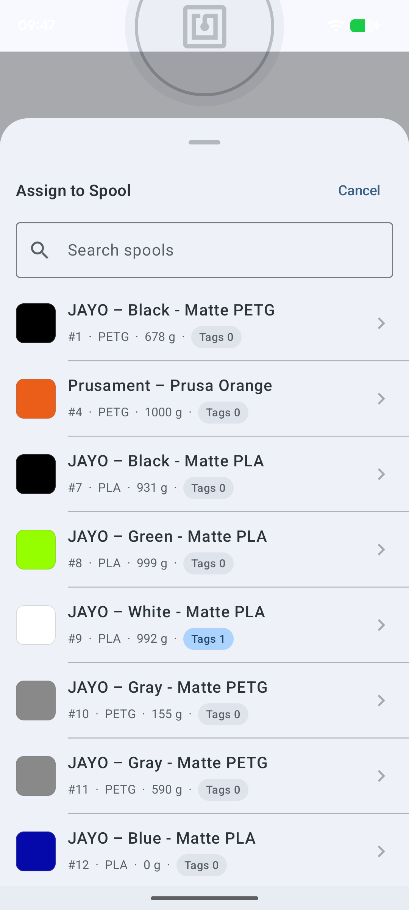</a>

## Create New Spool — Manual

Form to create a new Spoolman spool. Fields are pre-filled from the OpenSpool tag data
but remain editable. The scanned card UID is attached automatically.

<a href="images/android/06-create-spool-sheet.png">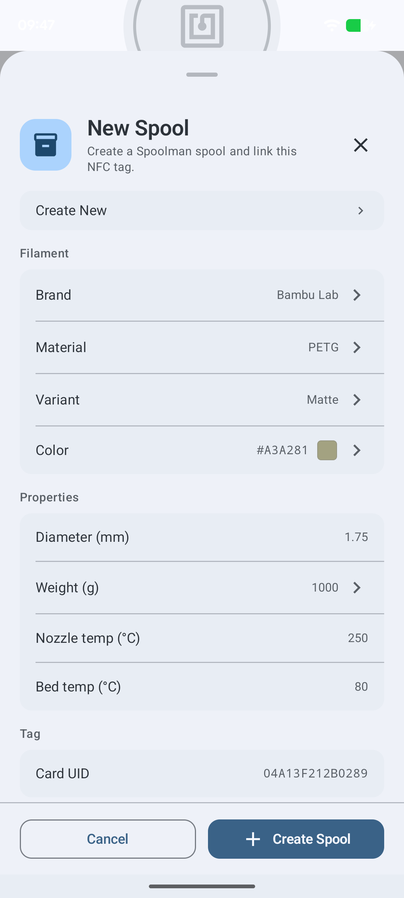</a>

## Create New Spool — Existing Filament

When an existing Spoolman filament is selected from the picker, all filament fields lock
to that filament's values (shown with lock icons).

<a href="images/android/07-create-spool-with-filament.png">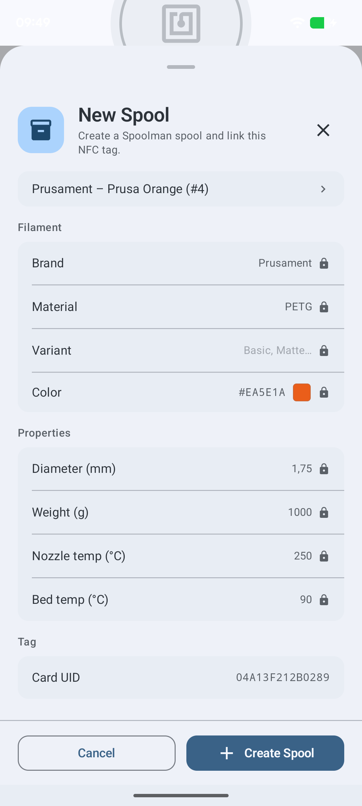</a>

## Spools

Full spool list fetched from Spoolman, ordered by the active filter. Each row shows the
color swatch, filament name, material, remaining weight, and tag count.

<a href="images/android/08-spools-list.png">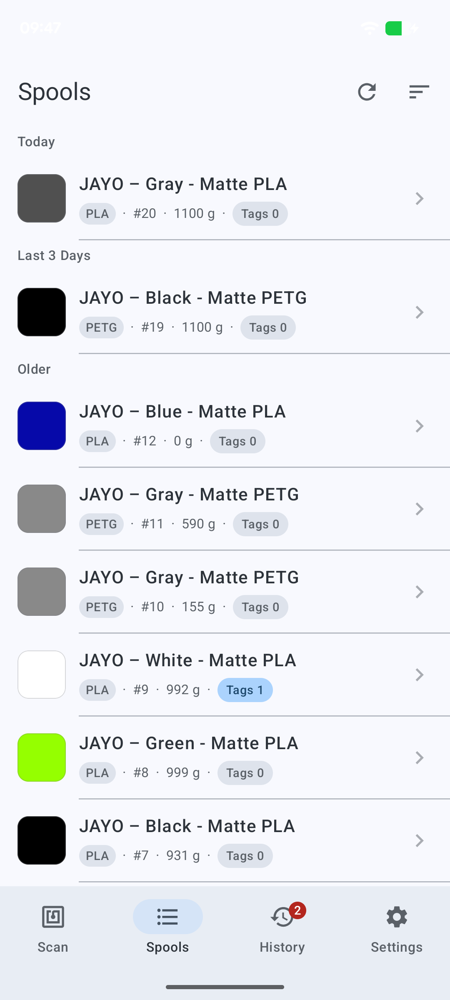</a>

## Spool Detail

Bottom sheet with complete spool metadata: remaining weight, color, diameter, print
temperatures, dates, and all assigned NFC tag UIDs. Actions: assign another tag or
open the spool directly in Spoolman.

<a href="images/android/09-spool-detail-sheet.png">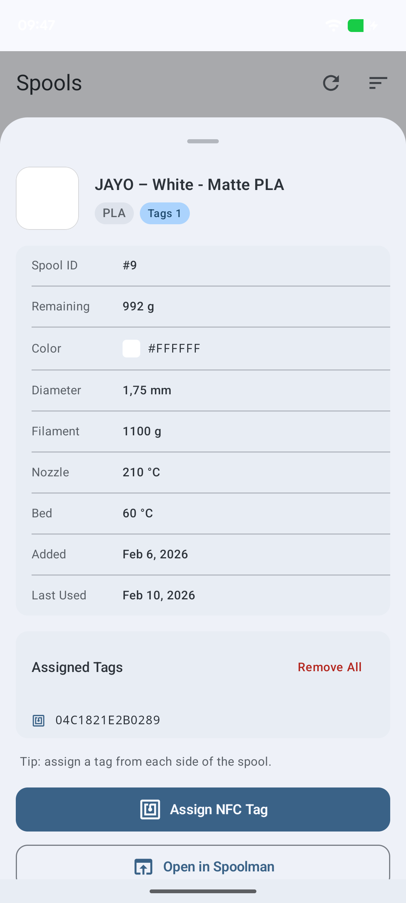</a>

## Spool Detail — Assign NFC Tag

Tapping **Assign NFC Tag** activates NFC scanning directly from the spool detail sheet.
The button changes to "Scanning for tag…" until a tag is detected and linked.

<a href="images/android/10-spool-detail-assign-tag.png">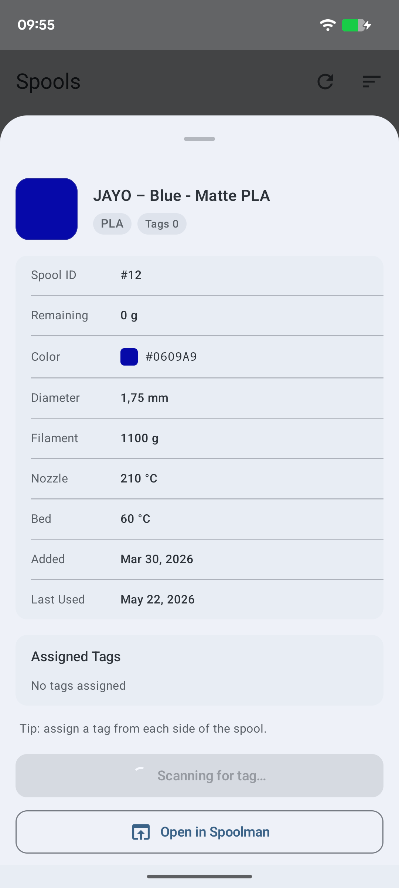</a>

## Spool Detail — Remove All Tags

Tapping **Remove All** shows a confirmation dialog before detaching all NFC tag UIDs
from the spool.

<a href="images/android/11-spool-detail-remove-all.png">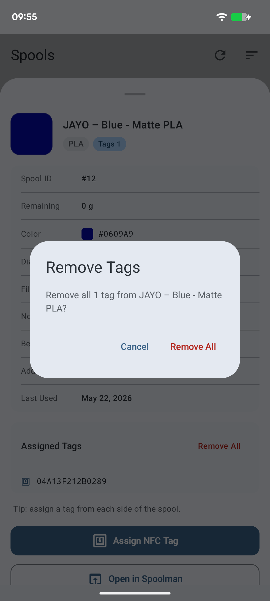</a>

## History

Log of every NFC scan in this session. Each entry shows the tag format, card UID,
matched spool (if any), and timestamp.

<a href="images/android/12-history.png">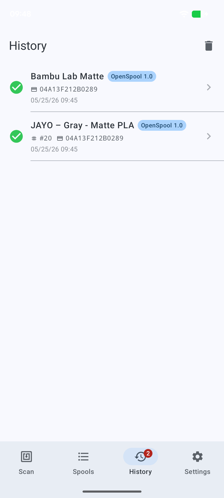</a>

## Settings

Spoolman server URL with a connection test, filament name pattern for new spools, and
editable presets for brands, materials, and variants.

<a href="images/android/13-settings.png">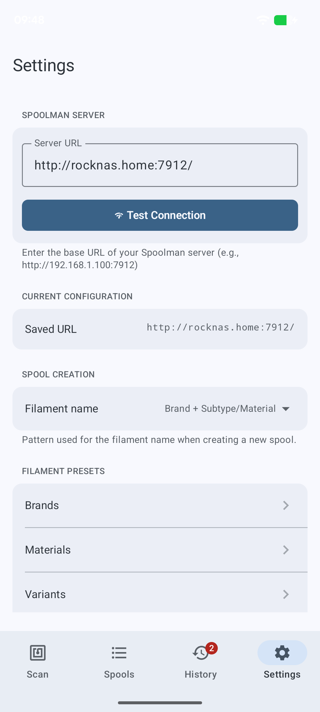</a>

## Settings — Connection Test

Tapping **Test Connection** validates the server URL by running a sequence of API checks
(info endpoint, `card_uids` field, filament field). On success a **Save** button appears
to persist the URL.

<a href="images/android/14-settings-connection-ok.png">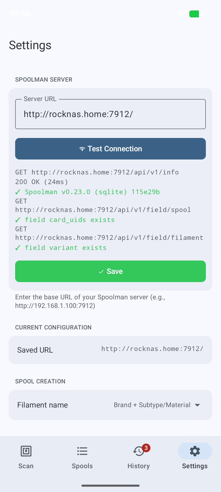</a>
